# Olist Price Elasticity

--- 

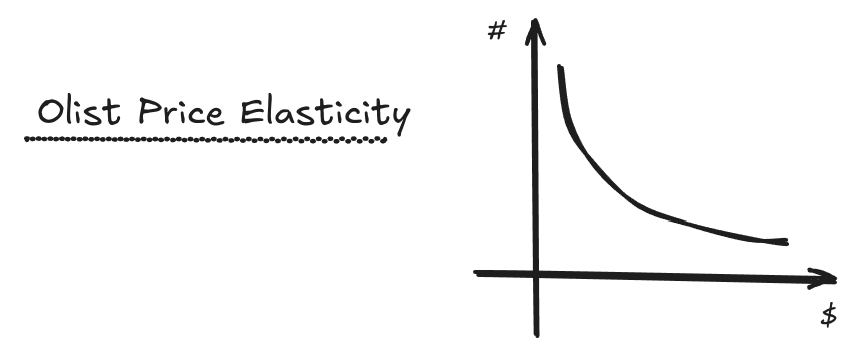

---

### Summary

- [1.0. Business Problem](#10-bussiness-problem)
- [2.0. Solution Strategy](#20-solution-strategy)
  - [2.1. Problem Solving Methodology](#21-problem-solving-methodology)
- [3.0. Price Elasticity Exploration](#30-price-elasticity-exploration)
  - [3.1. EDA and Product Checkout](#31-eda-and-product-checkout)
  - [3.2. Week over Week Scenario](32-week-over-week-scenario)
- [4.0. Data Infrastructure](#40-data-infrastructure)
  - [4.1. OLTP and ETL](#41-olt-and-etl)
  - [4.2. Data Science](#42-data-science)
  - [4.3. Weekly Orchestration](#43-weekly-orchestration)
- [5.0. Business Results](#50-business-results)
- [6.0. Next Steps](#60-next-steps)

---

## 1.0. Business Problem

---

**Business Overview**: Olist is a Brazilian startup that operates in the retail technology segment. The company has solutions that facilitate the management of offline and online stores (e-commerce) and also a solution for increasing sales within marketplaces. On the one hand, Olist concentrates sellers who want to advertise on marketplaces such as Mercado Livre, Americanas and Amazon. On the other hand, concentrate products from all sellers in a single store that is visible to the end consumer. Olist was founded in February 2015 by Tiago Dalvi, as a spin-off from Solidarium, a company created in 2007 as a shopping store that later became a marketplace for the sale of artisanal products.

Source: Wikipedia.

**Business Problem**: In Olist, products is selled by a people called `seller` and exists some key products to drive sales, such as top 10% or top 20% most selled products, this products can have unique pattern and some mining can be done with this products + orders data. Based on this context, olist is a marketplace and receive a fee (Seller sell products and olist receive maybe 10% ~ 25% of product price), a fee is how a marketplace receive money for joining sellers and customers. The products can have promo, discount, inflation adjust and other random events that change product price, this change can affect demand, people cannot buy more of a given product because the price is very expensive or people will buy a LOT of this product because have a very low price, this phenomenon can be easily seen in traditional grocery, older products have a very low price (in may cases) in promo or with discount to sell very fast because new and fresh products is available on warehouse just waiting to have space in product shelf to be placed and price up again.

"A good's price elasticity of demand (PED) is a measure of how sensitive the quantity demanded is to its price. When the price rises, quantity demanded falls for almost any good (law of demand), but it falls more for some than for others. The price elasticity gives the percentage change in quantity demanded when there is a one percent increase in price, holding everything else constant. If the elasticity is −2, that means a one percent price rise leads to a two percent decline in quantity demanded. Other elasticities measure how the quantity demanded changes with other variables (e.g. the income elasticity of demand for consumer income changes)".   

Source: Wikipedia.

Now, you need to build a infrastructure and a solution in weekly basis scenario to follow price elasticity of top olist products, with this solution some business people of different segments of Olist can track this elasticity for better decision taking.

- Revenue management teams to optimize their pricing & promotional strategy in actions to segment marketing, campains and products.
- Finance team can do a practical what-if scenario analyses of key price changes or discount actions. 
- Supply chain team can have a visibility into how specific promotional actions would impact inventory levels or how deep clearance price discounts need to be deplete over-bought inventory that's not selling. 


## 2.0. Solution Strategy

---

The solution strategy is to build a most simple data infrastructure to solve this problem, I selected key AWS services and Open Source tools to design a infrastructure for: data engineering (collect, conform and prepare data), data science (build price elasticity solution + eda + final delivery product) and mlops (re-train and version price elasticity solutions estimators).

### 2.1. Problem Solving Methodology

---

I have CRISP in my toolkit for rapid development of solutions and problem solving techniques, based on this, the author "Eric Ries" has a phrase in the book lean startup, "Vision leads to direction" and shows a cyclical process for startup fast projects solutions and can be applied to data science projects too!!!

CRIPS is published in 1999 to standardize data mining processes across industries, it has since become the most common methodology for data mining, analytics, and data science projects. Data science teams that combine a loose implementation of CRISP-DM with overarching team-based agile project management approaches will likely see the best results. CRISP-DM indirectly advocates agile principles and practices by stating: "The sequence of the phases is not rigid. Moving back and forth between different phases is always required. The outcome of each phase determines which phase, or particular task of a phase, has to be performed next." Thus if you follow CRISP-DM in a more flexible way, iterate quickly, and layer in other agile processes, you’ll wind up with an agile approach.

Source: Data Science PM.


## 3.0. Price Elasticity Exploration

---

Exists some solutions for Price Elasticity in marketing today.

- Linear Regression (Additive): Is the most easy and simple, i just need Price and Units selled to build a linear model to estimate elasticity using midpoint formula [ (avg price / avg unit) * slope ], this is a simple and very fast approach because exists some "pocket equations" to get simple two variable linear regression equation.
- Linear Regression with Exog features (Additive): This requires feature engineering and "exog" / extra features to build a simple linear regression, now with extra features, price and demand.
- Log Log Regression: This is alterantive to use Log of price and Log of demand, using this solution the slope of linear regression is percentage changes a.k.a elasticity, you can use extra features (exog features or not) for add more coeficients to linear regression estimation of PE.
- Linear Regression with Regularization + Exog Features: Is possible to apply regularization to reduce multi-colinearity when you using exog features.
- Machine Learning: Is possible to compute price elasticity with traditional Sklearn estimators (Decision Tree, Random Forest...) using machine learning to create a demand model. If you need explain to customer why this price is generated you can lose interpretation when using a very black box estimator. 

I will follow using Log Log Regression without extra exog features, this is my first solution, because is a great used solution today and easy to estimate (slope is elasticity), i will follow this approach because I do not need to deep dive in feature engineering in this first CRISP solution. With CRISP i need to delivery a very fast MVP solution to validate project and next CRISP iterations i deep dive into other steps of the solution (Data Engineering, Data Science and Mlops), but for my first delivery i will follow a very simple approach. 

The second reason i will use a simple log log linear regression is because the dataset have very low samples, is very hard to fit a random forest with small sample, but is possible. 


### 3.1. EDA and Product Checkout

---

The EDA is a very simple Price x Demand and descriptive statistics of this products to check variation, min, max and a most important key discovery -> some products does not have much samples to work and any product have linear relationship, this is a very hard scenario for log log linear price elasticity, but lets go with that!

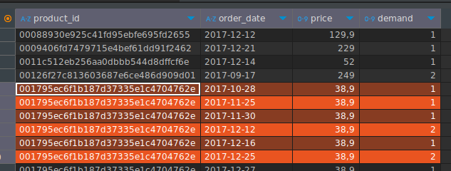

Is possible to see in more details about this relationships in [modelling & business notebook](notebooks/price_elasticity.ipynb).

I selected top 3 products only, (8c591ab0ca519558779df02023177f44, 165f86fe8b799a708a20ee4ba125c289 and 461f43be3bdf8844e65b62d9ac2c7a5a), lets talk about this products in more details.

I like product "165f86fe8b799a708a20ee4ba125c289" is special, when you increase the price, the demand increase too, is very cool to see, but why ?
Maybe if i include more features such as sazonality, warehouse quantity on this selling date, etc. Other features (features from mind map) maybe is possible to see why this happen!
Is a very low increase in price, is just cents...

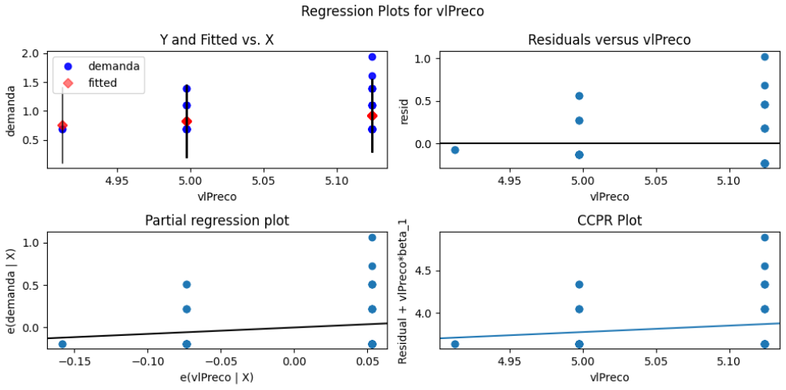

Looking at product "8c591ab0ca519558779df02023177f44", estimating price elasticity with OLS i get this results: if the price increase 10%, the demand decrease by 9.4%.

```
==============================================================================
                 coef    std err          t      P>|t|      [0.025      0.975]
------------------------------------------------------------------------------
const          5.2980      1.569      3.377      0.001       2.147       8.449
price         -0.9626      0.341     -2.821      0.007      -1.648      -0.277
==============================================================================
```

Given a price of: 50, the demand is: 4.542.
Given a price of: 60, the demand is: 3.823.
Given a price of: 70, the demand is: 3.303.
Given a price of: 80, the demand is: 2.91.
Given a price of: 90, the demand is: 2.601.
Given a price of: 100, the demand is: 2.353.
Given a price of: 110, the demand is: 2.149.
Given a price of: 120, the demand is: 1.977.
Given a price of: 130, the demand is: 1.832.
Given a price of: 140, the demand is: 1.707.
Given a price of: 150, the demand is: 1.598.
Given a price of: 160, the demand is: 1.502.
Given a price of: 170, the demand is: 1.417.
Given a price of: 180, the demand is: 1.342.
Given a price of: 190, the demand is: 1.274.


### 3.2. Week over Week Scenario

---

I need to re-train the Price Elasticity every week and i need to track the evolution of Elasticity and Price X Demand for this three principal products:

- 8c591ab0ca519558779df02023177f44;
- 165f86fe8b799a708a20ee4ba125c289;
- 461f43be3bdf8844e65b62d9ac2c7a5a;

The main ideia is to have a machine learning governance and price elasticity versions for compare price x demand in past and present, the assumption is, if i increase the price WoW (Week over week), the demand can change and is very important to business keep track of this changes weekly.

Assumption: Today is "2018-01-01", i will first train the Elasticity Regression with OLS for this three products.

For the next three weeks in weekly basis the business need to re-train the price elasticity and compare the results between the weeks. 

Today (2018-01-01) i have all past observations in a database, such as Data Warehouse or Lakehouse, does not matter, the key point is, for the next 7 days up to 2018-01-08 the products can be purchased again and in date 2018-01-08 a new price elasticity model need to be trained for capture new cliets pattern and for compare with last week.

Now its time to check the variation of Demand x Price and compute descriptive statistics with that.

Is possible to check some of the descriptive statistics and elasticity change over time because cliets is purchasing the products and a new price elasticity need to be generated for every week.

For example, for product: 165f86fe8b799a708a20ee4ba125c289, the elasticity change week over week...

```
==================================================
Train Week: 2018-01-01
Elasticity: 0.8299, P-Value: 0.2248, R2: 0.0341
==================================================
Train Week: 2018-01-08
Elasticity: 0.7554, P-Value: 0.2414, R2: 0.0279
==================================================
Train Week: 2018-01-15
Elasticity: 0.6982, P-Value: 0.2628, R2: 0.0240
```

Is possible to track, versionate and do much other things with mlflow!


### 3.3. Mind Map

---

Mind Map is a tool to help in feature engineering and integrate teams, is a very good tool for undertand business process that generate an event of interest such as order, product selling, promotion, discount and other things that generate my interest event (model price elasticity), In the mind map I will create branches that are factors that influence the event of interest in some way, whether positively or negatively. This way I can understand which attributes will help the demand estimator.

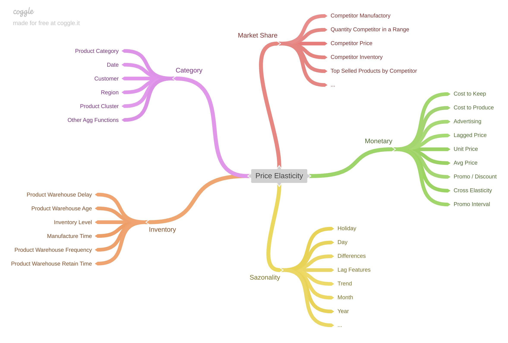

## 4.0. Data Infrastructure

---

The main ideia is to use develop a architecture with AWS, Kubernetes and other Open Source Tools. All tools (aws service and kubernetes deployments) is deployed using Hashicorp Terraform.

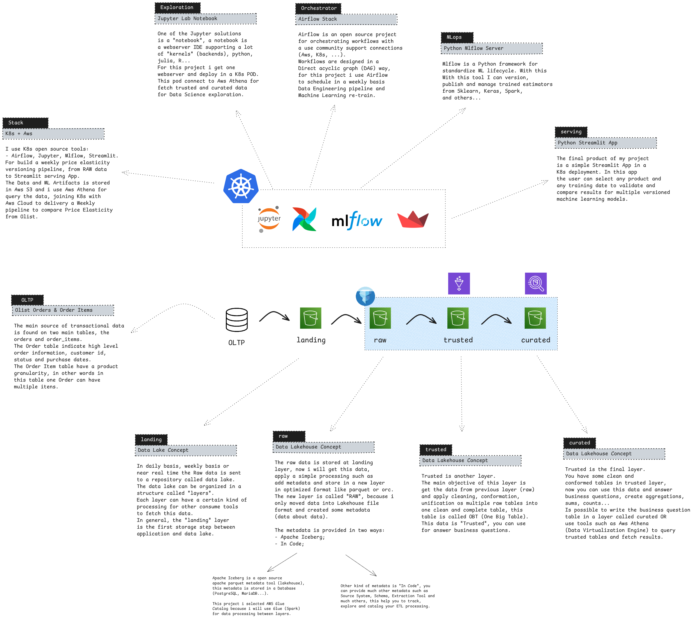

I use K8s open source tools: Airflow, Jupyter, Mlflow, Streamlit.

For build a weekly price elasticity versioning pipeline, from RAW data to Streamlit serving App. The Data and ML Artifacts is stored in Aws S3 and i use Aws Athena for query the data, joining K8s with Aws Cloud to delivery a Weekly pipeline to compare Price Elasticity from Olist. 

- Jupyer Lab Notebook: One of the Jupyter solutions is a "notebook", a notebook is a webserver IDE supporting a lot of "kernels" (backends), python, julia, R... For this project i get one webserver and deploy in a K8s POD. This pod connect to Aws Athena for fetch trusted and curated data for Data Science exploration.
- Airflow Stack: Airflow is an open source project for orchestrating workflows with a use community support connections (Aws, K8s, ...). Workflows are designed in a Direct acyclic graph (DAG) way, for this project i use Airflow to schedule in a weekly basis Data Engineering pipeline and Machine Learning re-train.
- Mlflow Server: Mlflow is a Python framework for standardize ML lifecycle. With this With this tool I can version, publish and manage trained estimators from Sklearn, Keras, Spark, and others...
- Streamlit: The final product of my project is a simple Streamlit App in a K8s deployment. In this app the user can select any product and any training date to validate and compare results for multiple versioned machine learning models.

Now, in AWS i used some key services:

Aws S3 for object Storage in three consumption layers (landing, trusted and curated).

- landing: In daily basis, weekly basis or near real time the Raw data is sent to a repository called data lake. The data lake can be organized in a structure called "layers". Each layer can have a certain kind of processing for other consume tools to fetch this data. In general, the "landing" layer is the first storage step between  application and data lake.
- raw: The raw data is stored at landing layer, now i will get this data, apply a simple processing such as add metadata and store in a new layer in optimized format like parquet or orc. The new layer is called "RAW", because i only moved data into Lakehouse file format and created some metadata (data about data). The metadata is provided in two ways - Apache Iceberg and In Code;
- trusted: Trusted is another layer. The main objective of this layer is get the data from previous layer (raw) and apply cleaning, conformation, unification os multiple raw tables into one clean and complete table, this table is called OBT (One Big Table). This data is "Trusted", you can use for answer business questions.
- curated: Trusted is the final layer. You have some clean and
conformed tables in trusted layer, now you can use this data and answer business questions, create aggregations, sums, counts... Is possible to write the business question table in a layer called curated OR use tools such as Aws Athena (Data Virtualization Engine) to query trusted tables and fetch results.

### 4.1. OLTP and ETL

---

The main source of transaction data is stored in a solution called OLTP (Online Analytical Processing), in simple words is a traditional CRUD database. I selected this two tables (orders and items) and stored in landing in parquet format, this can be done using a Kubernetes POD with kind: Job for schedule a batch etl or real time with deployment extraction pod, i used a simple batch to fetch data from OLTP and store in landing parquet files, to simplify i copy this files and put in `landing` folder of this git repo to terraform just copy this files if you like to reproduce this experiment.

Now, to build a cleaning pipeline i used only AWS Glue with Spark simple jobs, this jobs will create apache iceberg format in Raw and clean and conform data in Trusted S3 layer, the metadata is found on Aws Glue Database (Hive metastore from AWS), is possible to use Spark on K8s and Hive Metastore deployment istead of Aws Glue and Glue Catalog Database.

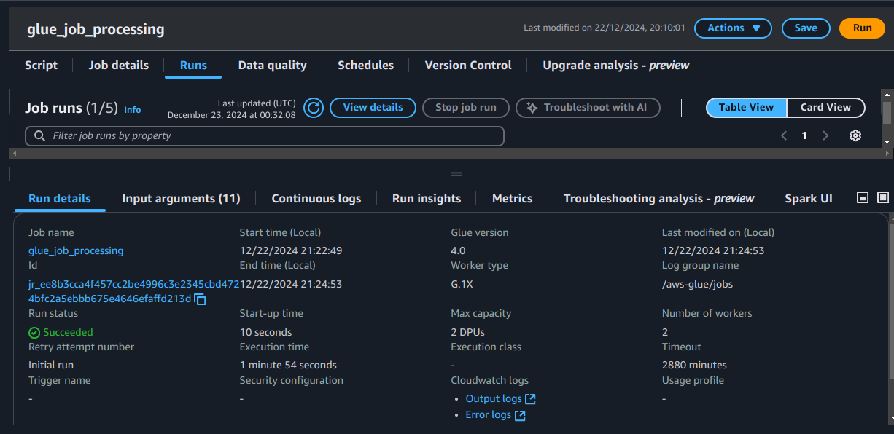

### 4.2. Data Science

---

I will use the topic Data Science for two main objectives, talk about ML Experiments and Serving the solution using streamlit.

Mlflow server is a kubernetes deployment inside k8s using community helm chart, the mlflow artifacts is stored in Aws S3 bucket and experiments metadata in PostgreSQL inside K8s, the definition of runs (each machine learning train using mlflow) is organized in a very simple name pattern `estimator-train_date-product_id` with this pattern i can easy filter with `search_runs` using a mlflow client connection to mlflow server.

Is possible to see in print below all training experiments for each product_id, you can have nesting runs and more complex tree-structure to organize machine learning runs in each experiment and visualize this structure in mlflow webserver ui.

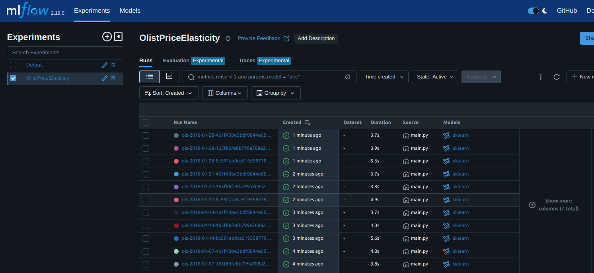

Mlflow is the main solution for track price elasticity version and key parameters and metrics such as slope, constants and other linear regression coeficients, mlflow provide tools for compare runs and visualize machine learning artifacts inside mlwlfow webserver ui.

Now, lets talk about the serving solution, is very common today the streamlit applications for deploy any kind of data science or webserver solution, its easy and simple to start and very user frendly interface and rich community for python users, behind the door, my streamlit app is a simple stateless webserver service that connect to mlflow server using k8s services, fetch experiments and show on a visual interface for users. In my app exists two main tabs, `simulate demand` and `weekly price elasticity`.

Is possible to provide a price, for example 100 and the line plot show the demand for all of the three products in all existing training week dates, is possible to compare elasticity between model version and products.

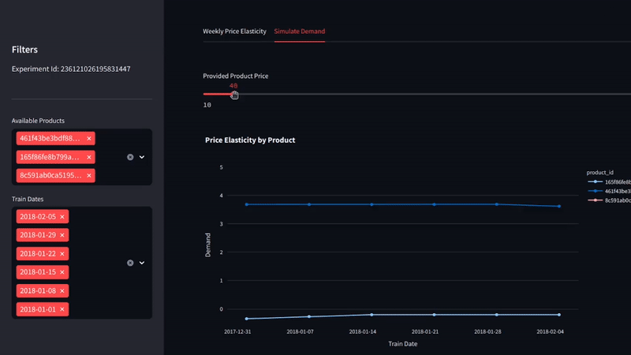

Another line plot is show price elasticity over product and version train date.

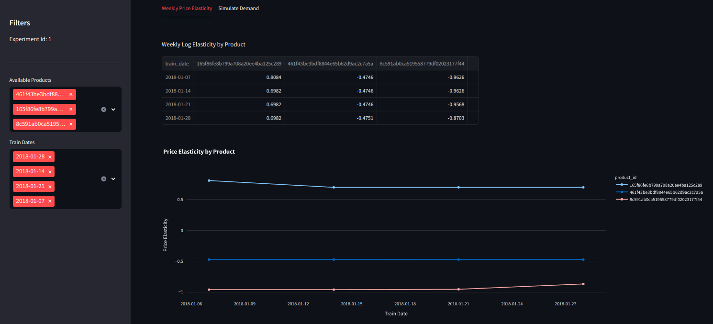


### 4.3. Weekly Orchestration

---

All orchestration and weekly schedule is using Airflow, in airflow you can re-run past runs with `catchup=True`, is possible with this feature simulate past runs and get this execution dates of a task instance and send with enviroment variable to re-training batch job inside K8s to see and simulate every use case that you need to go back in past and explore "what is in this past" all past executions in this prints below, is amazing, the complete workflow is here and i can simulate production weekly use case!

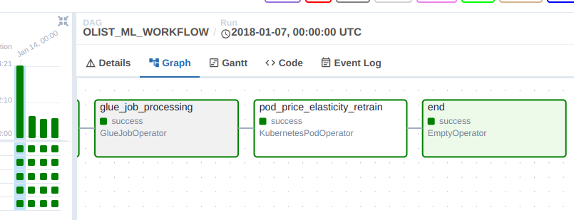
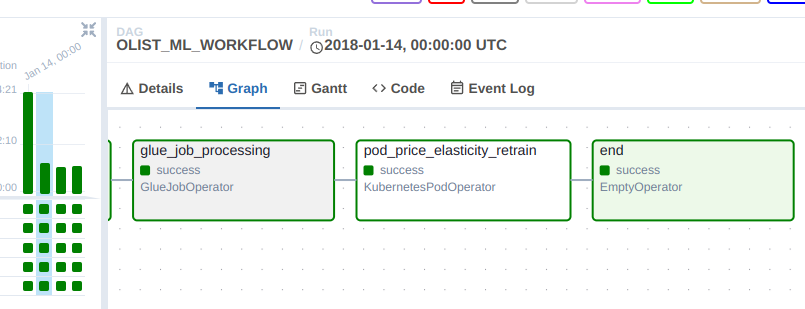
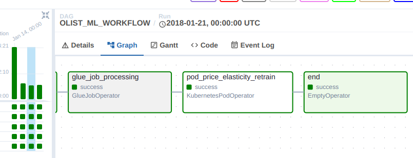
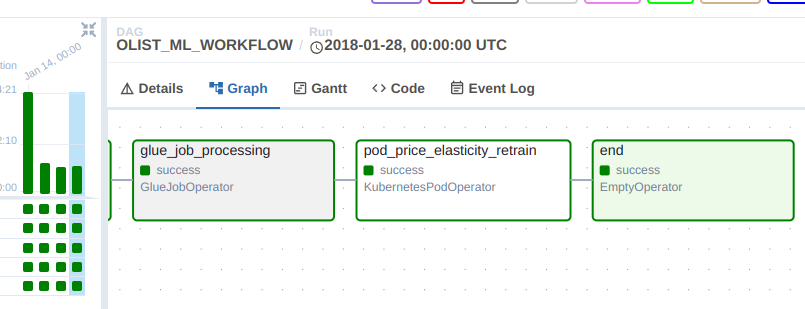

The airflow will execute batch extraction from source system (OLTP), Aws Glue for clean the data and re-train machine learning model weekly. 


## 5.0. Business Results

---

The main objective is to build a end-to-end re-train price elasticity solution to follow price variation over multiple weeks and give a business user a tool to compare price elasticity between weeks and products.


## 6.0. Next Steps

---

I have build a base project, is possible to deep dive in every step of this project, for example, going deep into `OLTP sistems` and build a real time orders generator based on simulations from Olist Dataset to create a Real Time Source System or Deep Dive into Price Elasticity modeling techniques to develop more robust and complete price elasticity solution using feature engineering (seasonality and time series features like lag units, price, differences, product behavior such as category, subcategory, type, warehouse quantity... and much other features), apply other techniques (Sklearn, Decision Tree, feature importance), is possible to deep dive in some of the steps in this project. 
